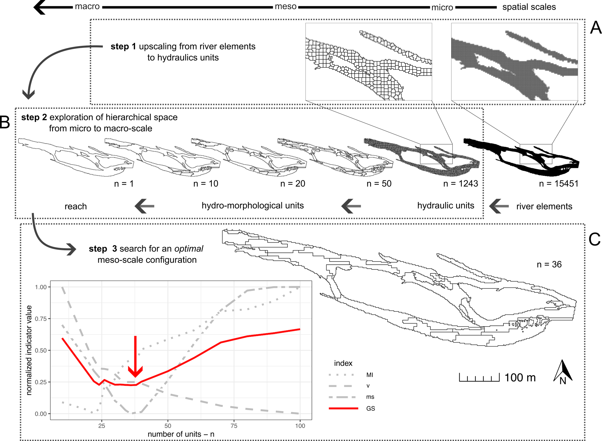

<!-- README.md is generated from README.Rmd. Please edit that file -->

# mesounitR

<!-- badges: start -->

<!-- badges: end -->

The **mesounitR** software segments a river reach into a mosaic of
mesohabitats using a three-step process based on outputs from 2D
hydraulic modeling.

**Step 1:** Mesh elements from the hydraulic model, corresponding to
river elements, are up-scaled into supercells, corresponding
approximately to the scale of small hydraulic units (Fig. 1, A).

**Step 2:** Potential habitat configurations are explored across the
entire spatial spectrum, ranging from small hydraulic units
(micro-scale) to the reach (macro-scale) (Fig. 1, B).

**Step 3:** An optimal meso-scale configuration based on desired
meso-scale characteristics is selected by minimizing a Global Score
(Fig. 1, C). The Global Score is based on three metrics representing
intra-segment homogeneity, inter-segment heterogeneity, and an optimal
range of segment numbers based on an empirically defined meso-scale.

The workflow is river-independent and fully unsupervised, as it does not
require calibration or subjective choices of segmentation parameters.

<figure>

<figcaption aria-hidden="true">Figure 1: 3 step mesohabitat
segmentation</figcaption>
</figure>

## Installation

You can install the development version of mesounitR from
[GitHub](https://github.com/) with:

``` r
# install.packages("pak")
pak::pak("david-faro/mesounitR")

# or
# install.packages("devtools")
# remotes::install_github("david-faro/mesounitR")
```

## Usage

The following tutorials are available:

- [Step-by-step tutorial on the usage of
  mesounitR](https://github.com/david-faro/mesounitR/blob/master/vignettes/tutorial-mesounitR.Rmd)
- [integration with MesoHABSIM using Simstream-Web
  tool](https://github.com/david-faro/mesounitR/blob/master/vignettes/processing_MesoHABSIM.Rmd)

## Issues

Submitting [issues](https://github.com/david-faro/mesounitR/issues),
bugs, or suggested feature improvements are highly encouraged for this
repository.

## References

Please refer to the following references for in-depth descriptions of
the methodology and software:

- Farò, D., Baumgartner, K., Vezza, P., & Zolezzi, G. (2022). A novel
  unsupervised method for assessing mesoscale river habitat structure
  and suitability from 2D hydraulic models in gravel-bed rivers.
  Ecohydrology, 15(7), e2452. [doi:
  10.1002/eco.2452](https://doi.org/10.1002/eco.2452)
- Vezza et al. (in review). Mesohabitat delineation and modelling in
  river channels.
